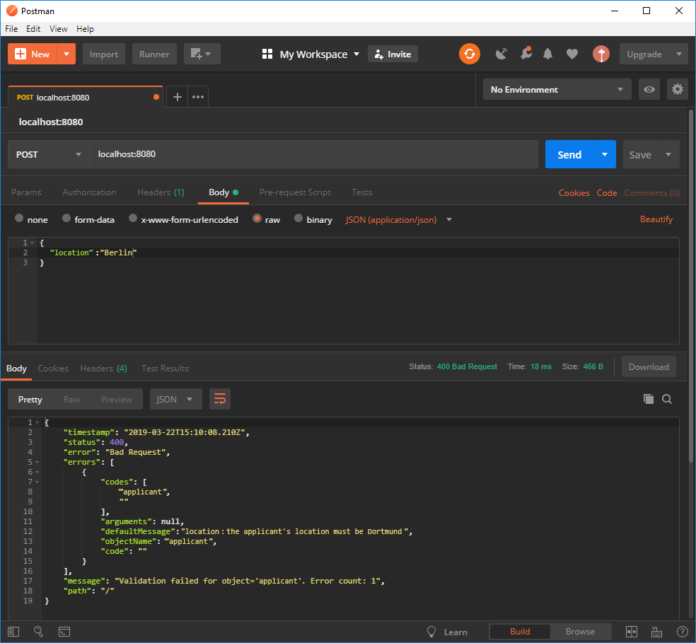
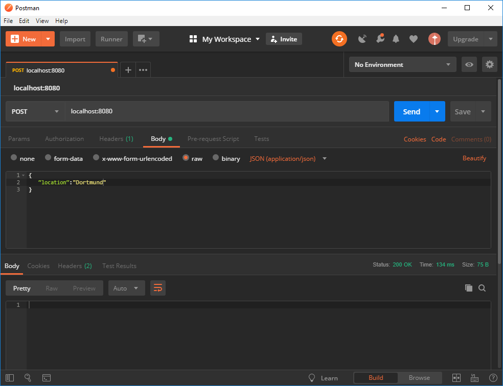
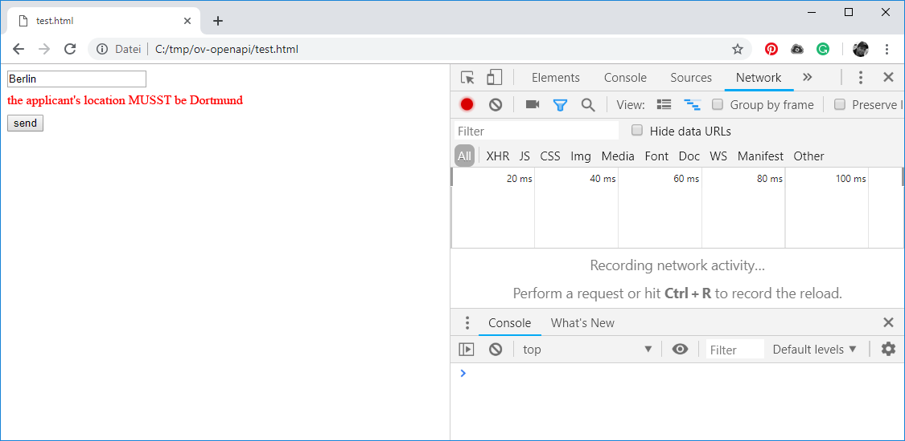
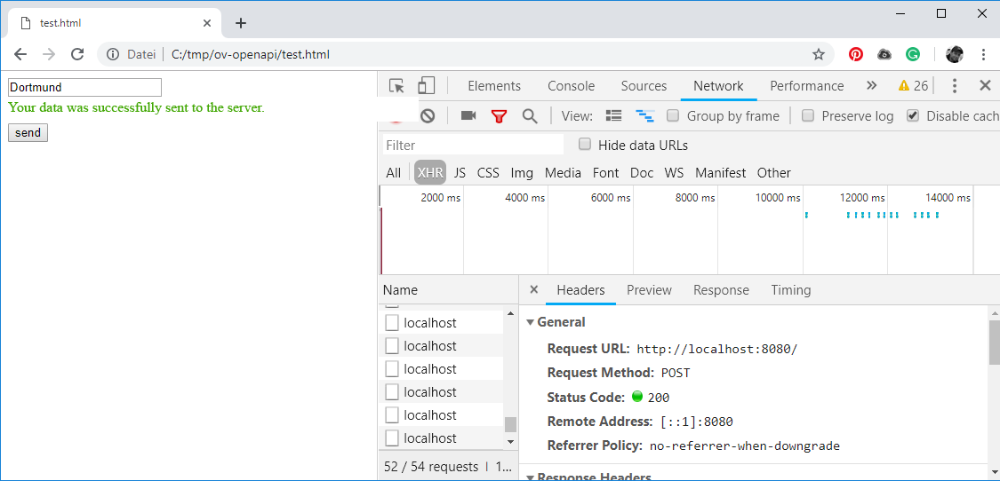

# OpenAPI Tutorial

To demonstrate the functionality of the OV-OpenAPI code generator, we should implement an example together.

1. First we create a Service Contract in OpenAPI Specification. 
2. We then add validation rules to the service contract. 
3. We generate a service stub based on the service contract. 
4. Then test it with Postman. 
5. And if we get bored in the end, we create a JavaScript client from the same service contract, which will execute the validation rules on the client side before the data is sent to the service.  


For this example certain knowledge like OpenAPI, NPM and basics of modern frontend development are required. Furthermore, the following technical requirements must be met:

Java Version                                          [1.8](https://www.oracle.com/technetwork/java/javase/downloads/jre8-downloads-2133155.html)  
NodeJS \(incl. npm\) from Version       [8.5](https://nodejs.org/en/download/)  
Browserify                                              [LATEST](http://browserify.org/#install)  
Postman                                                 [LATEST](https://www.getpostman.com/downloads/)

ov-openapi-generator-cli.jar               [ __](http://download.openvalidation.io/ov-openapi-generator-cli.jar)  


## 1. Create service contract in OpenAPI

First of all we create a new working directory



Press the `WINDOWS` key, enter 'CMD' and open the console by pressing `RETURN`.   
Create project directory

```bash
mkdir C:\tmp\ov-openapi
cd c:\tmp\ov-openapi
```



Open up your shell and enter the following commands:

```bash
mkdir /tmp/ov-openapi
cd /tmp/ov-openapi
```



In the working directory we create a new OpenAPI specification



```bash
echo > oapi.spec.yaml
```



```bash
echo > oapi.spec.yaml
```



We then open the oapi.spec.yaml with any text editor. For this example we use the atom IDE. So let's open the previously created project directory with atom \(or the text editor of your choice\).

```bash
atom . oapi.spec.yaml
```

Now we add the following content to our specification:



```yaml
openapi: "3.0.0"
info:
  version: 1.0.0
  title: openVALIDATION example
  description: openVALIDATION integration example.
paths:
  /:
   post:
      requestBody:
        content:
          application/json:
            schema:
              $ref: '#/components/schemas/applicant'
      responses:
        '200':
          description: success
components:
  schemas:
    applicant:
      type: object
      properties:
        name:
          type: string
        age:
          type: integer
        location:
          type: string

```



Our service contract defines a **REST service** with a **POST operation**. This service operation accepts a complex data structure defined by the applicant **schema**. The schema itself consists of only 3 attributes: **name**, **age** and **location**.


## 2. Adding a Validation Rule to the Service Contract

Now we would like to give our Service Contract a certain validation rule. Let's say that the applicant's location must always be Dortmund. We simply add a new definition called `x-ov-rule` directly after the reference to the schema \(line 14\). This is what our finished Service Contract looks like:



```yaml
openapi: "3.0.0"
info:
  version: 1.0.0
  title: openVALIDATION example
  description: openVALIDATION integration example.
paths:
  /: 
   post:
      requestBody:
        content:
          application/json:
            schema:
              $ref: '#/components/schemas/applicant'
            x-ov-rules:
              culture: en
              rule: |
                the location of the applicant MUST be Dortmund
      responses:
        '200':
          description: success
components:
  schemas:
    applicant:
      type: object
      properties:
        name:
          type: string
        age:
          type: integer
        location:
          type: string
```



Now we are ready to go and can generate the actual REST service.


## 3. Generate the Service Stub as Java Spring Boot

To generate the Service Stub we use the Custom OpenAPI Generator from openVALIDATION. This generator is a Java CLI application, which is available as a JAR file called **ov-openapi-generator-cli.jar**. To generate it we use the following CLI call:



```bash
java -jar ov-openapi-generator-cli.jar generate ^
     -g ov-java-spring-server ^
     -i oapi.spec.yaml ^
     -o out/server
```



```bash
java -jar ov-openapi-generator-cli.jar generate \
     -g ov-java-spring-server \
     -i oapi.spec.yaml \
     -o out/server
```



The parameter **`-g`** `ov-java-spring-server` tells the OpenAPI generator to use the special openVALIDATION generator called **ov-java-spring-server**. This generator extends the standard functionality of the already existing OpenAPI generator named **Spring** by generating additional validation rules, which in turn are defined behind the OpenAPI extension **x-ov-rules**.

After a successful generation process, a new folder structure is created directly in the working directory \(**out/server**\). There you will find our generated service Stub. More precisely, a Maven project, which we can open with a Java capable IDE, like IntelliJ.

However, we also have the option to get started immediately by simply compiling and starting the generated project:

```bash
cd out/server
mvn clean package
java -jar target/openapi-spring-1.0.0.jar
```

If everything worked out, the service is already running on port 8080 and can simply be called up in the browser at [http://localhost:8080/](http://localhost:8080/) :



The openVALIDATION generator has the standard functionality of the original OpenAPI generator and just adds the abilty of processing the **x-ov-rules** extension. This processing includes the generation of validation rules and their integration into the respective framework, e.g. Spring Boot. Customization is implemented according to the official Customization Guide \([https://openapi-generator.tech/docs/customization.html](https://openapi-generator.tech/docs/customization.html)\) of the OpenAPI Generator.



## 4. Testing the Service and the Validation Rule

To test the service you can of course use the integrated OpenAPI or Swagger test page. We can also send a POST request with other REST-enabled tools, such as Postman, which is used in this example. This is what our request looks like:

```javascript
{
    "location" : "Berlin"
}
```



As expected, we receive an error message saying that the applicant's location must be Dortmund. This error message is generated by the validation rule specified by us. If we now change the value of the attribute Location in the request from 'Berlin' to 'Dortmund', the error message no longer appears.




## 5. Generating the Client Proxy

The service is now running and validates incoming requests diligently. But a service usually has more than just one validation rule. Depending on the complexity of the service or all services in a microservice ecosystem, there can be hundreds or thousands of rules. Most of the times clients only receive errors from the server, which means after the request has already been sent. Among other things, this leads to inefficient usage of time and puts additional strain on the servers. It would be better if data could already be validated on client-side. This has several advantages:

1. runtime performance
2. server loads are reduced
3. clients can be developed offline, because the exception handling is partly done on the client
4. service providers and consumers only have to define a single service contract and can be developed independently.

The custom openVALIDATION OpenAPI Generator allows the generation of validation rules not only in a service stub, but also in a REST client. The service providers thus have the possibility to provide validation of the data as a fixed component of the service contract. And the consumers can automatically generate a client proxy with the help of the generator. They no longer have to deal with the REST/HTTP infrastructure and the validation of the data, which is now an integral part of the client proxy. How it works exactly is shown in the following example.

First we generate a client proxy with the following CLI call:



```bash
java -jar ov-openapi-generator-cli.jar generate ^
     -g ov-javascript-client ^
     -i oapi.spec.yaml ^
     -o out/client
```



```bash
java -jar ov-openapi-generator-cli.jar generate \
     -g ov-javascript-client \
     -i oapi.spec.yaml \
     -o out/client
```



The CLI call creates a client proxy as a JavaScript project in the folder **out/client** below the current working directory. The client is a Nodejs project for which the dependent packages must be installed first.

```bash
cd out/client
npm install
```

We want to integrate the ClientProxy directly into an HTML page. To make this possible, we have to create a single JavaScript file from the JS project that can be executed in the browser. We do this with the help of a small tool called [Browserify](http://browserify.org/#install). Browserify is an npm package, which can be installed globally:

```bash
npm install -g browserify
```

After we have successfully installed Browserify, we can create an executable JavaScript Bundle: 

```bash
browserify src/index.js --standalone Bundle -o clientproxy.js
```

The call creates a JavaScript file called **clientproxy.js**, which we can use directly in the browser. Now we just have to create our demo HTML page. Therefore we create a file called **test.html** and add the following content:



```markup
<html>
  <body>

    <input id="message" />
    <div id="error"></div>
    <button onclick="send()">send</button>

    <script src="clientproxy.js"></script>
    <script type="text/javascript">
        var api = new Bundle.DefaultApi();
        api.apiClient.basePath = "http://localhost:8080";

        var send = function() {
            var data = {
              location: document.getElementById('message').value
            };

            api.rootPost(data)
               .then(
                 function(result) {
                   document.getElementById('error').innerHTML = 'Your data was successfully send to the server.';
                 },
                 function(error, data) {
                   var errrorMsg = (error.message)? error.message : error.errors[0].error;

                   document.getElementById('error').innerHTML = "<span style=\"color:red\">" + errrorMsg + "</span>";
                 }
               );
        }
    </script>
  </body>
</html>

```



Now we make sure that the REST service is already running. If it is not, we restart the service as described in [step 3](openapi-tutorial.md#3-generieren-des-service-stubs-als-java-spring-boot). We also open the HTML page and enter **"Berlin"** in the input field. As expected, the error message _"the **place** of the applicant **MUST** be **Dortmund**" appears_. The exciting thing about this is that this error message is generated on the client-side before sending the request to the server. We can check this by looking at the tab **Network** in DeveloperTools of Chrome:



If we now enter **"Dortmund"** instead of **"Berlin"**, we see that the request is sent to the server and a positive response with the HTTP status code **200** returns:



This example demonstrates the possibility of generating validation rules both within a service stub and within the corresponding client proxies. Even for different technology stacks.


In an enterprise environment with several 100 microservices and multitude of consumers per service, a significant reduction in implementation effort can be achieved. The use of openVALIDATION and openAPI Specification results in an enormous reduction of workload by automating a large part of these efforts.


